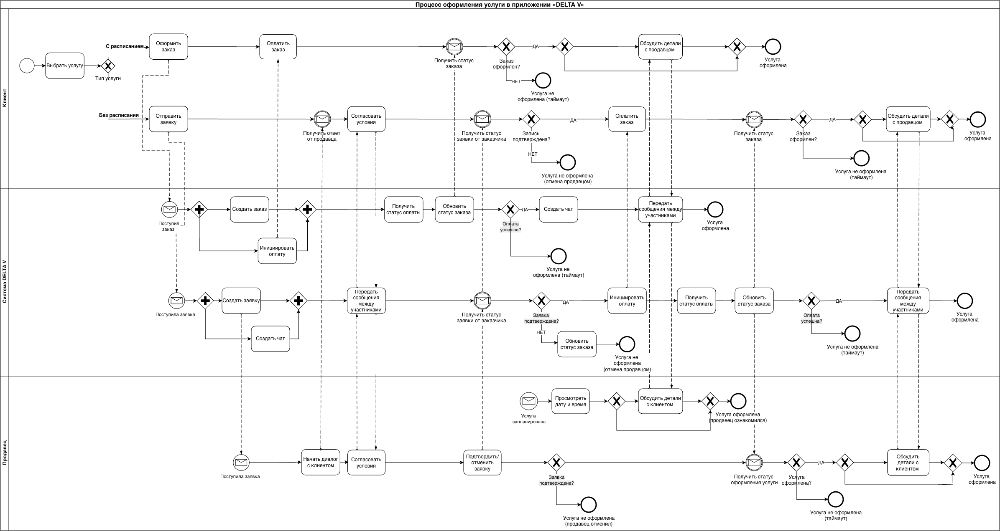
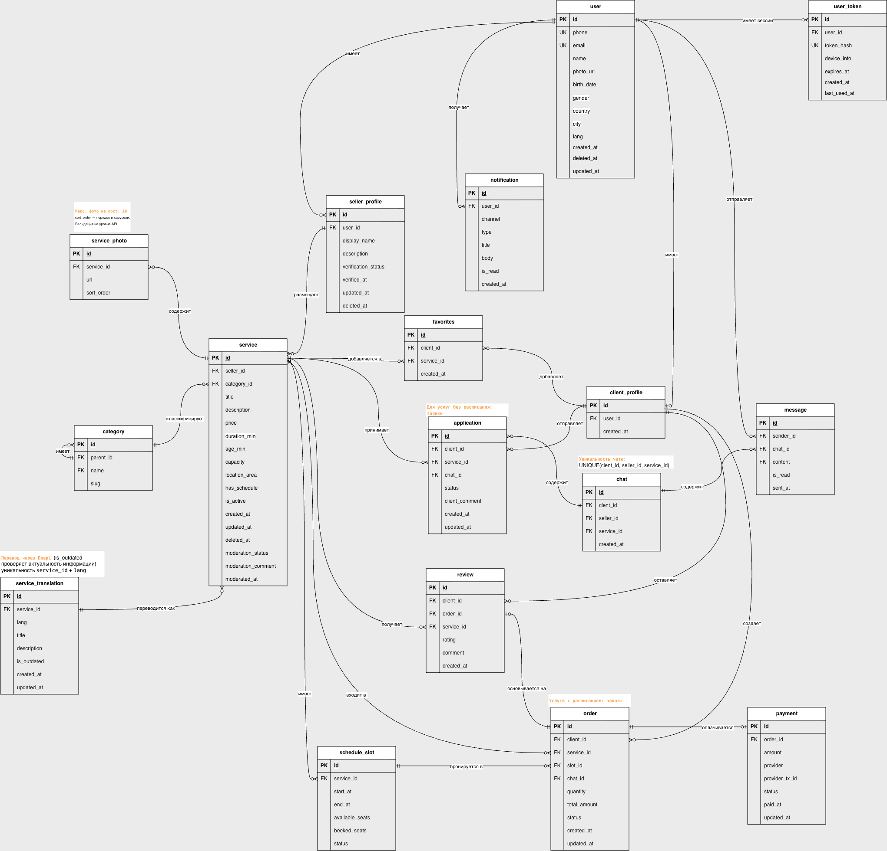
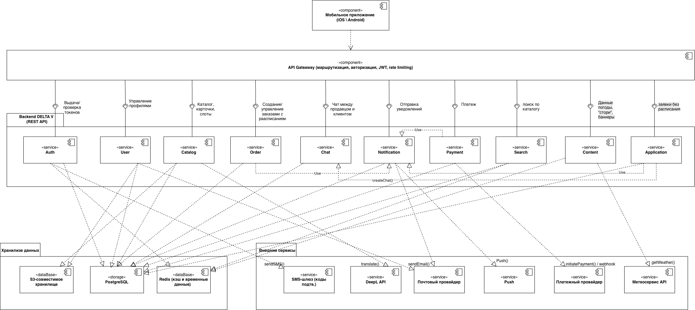
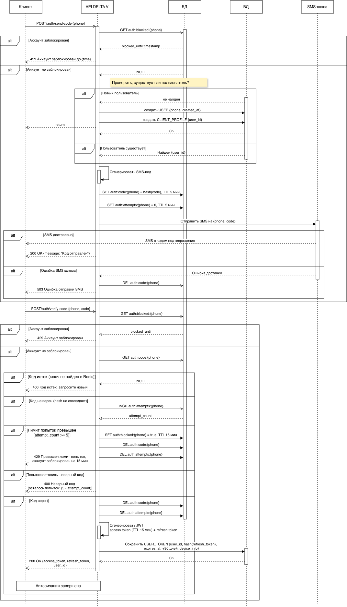
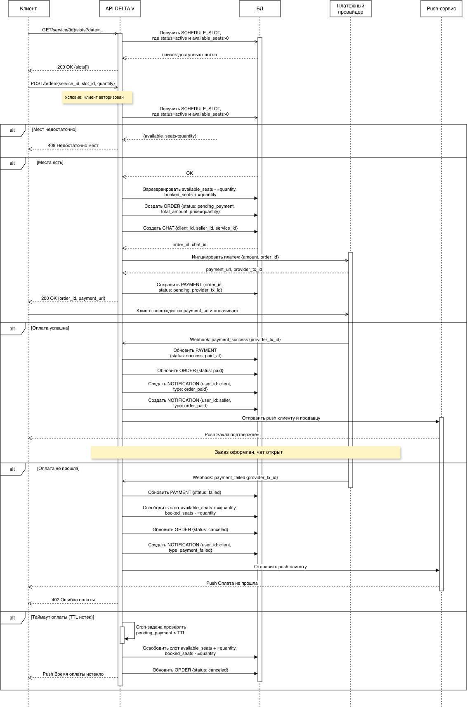
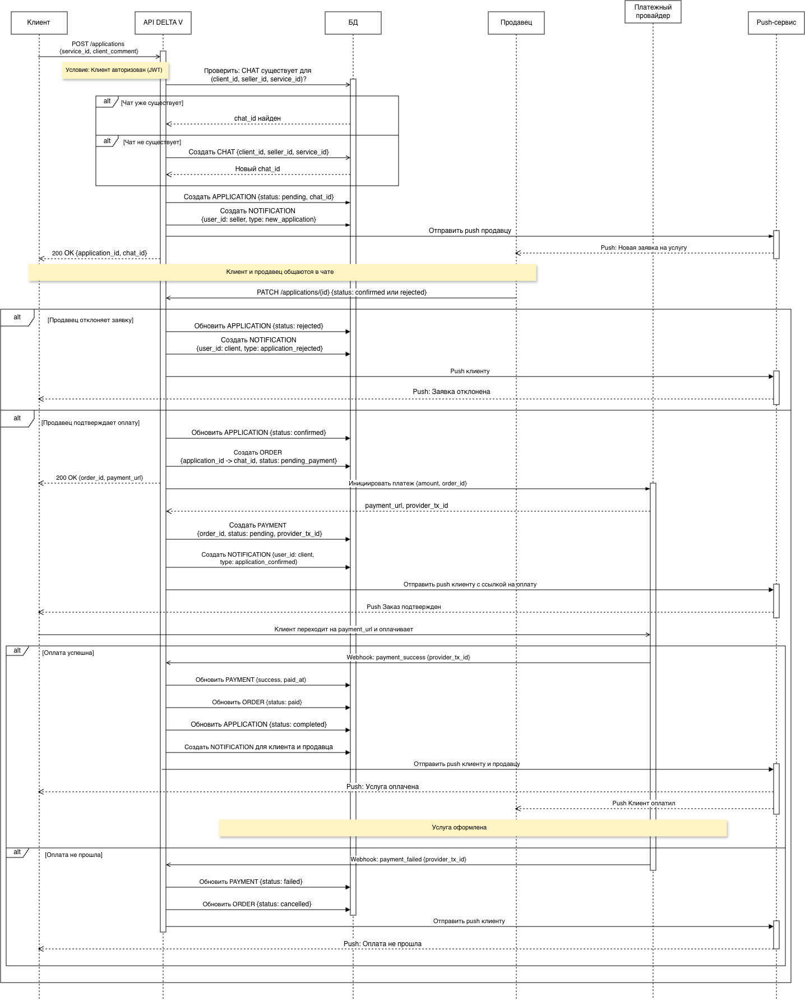
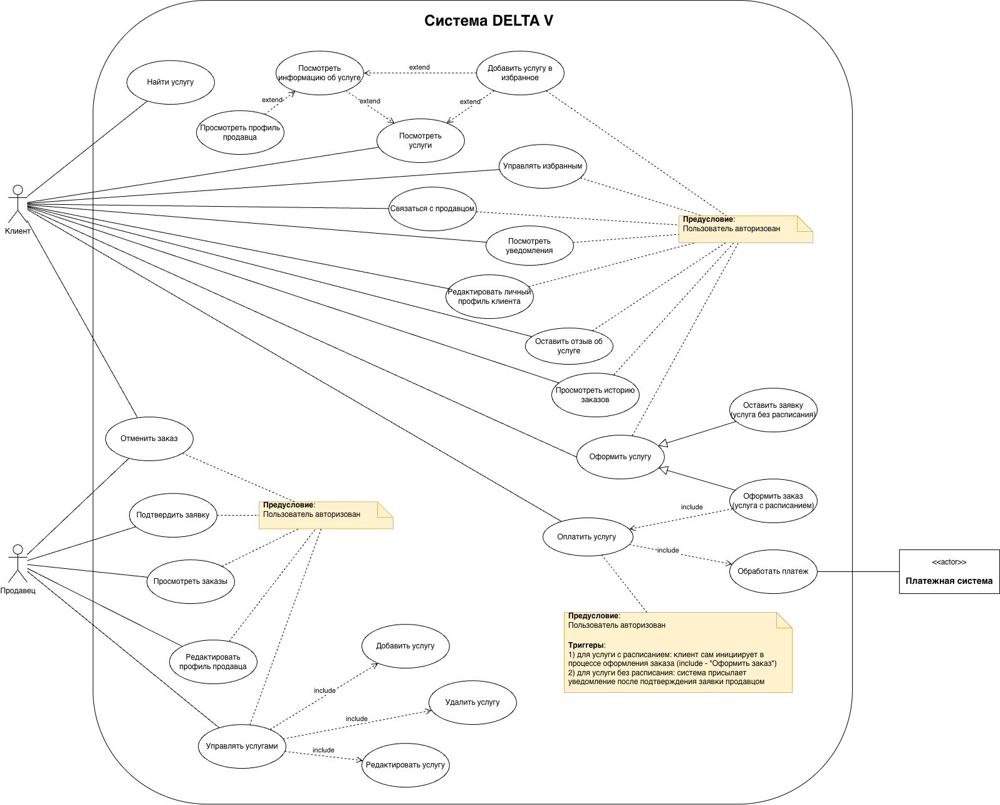

# DELTA V - Агрегатор услуг для отдыха в Приморском крае

> Портфолио-проект по системному анализу. Переработка документации реального нереализованного продукта в полноценную спецификацию.

---

## О проекте

**DELTA V** - мобильное приложение-агрегатор услуг активного и пассивного отдыха в Приморском крае. Платформа связывает клиентов с продавцами услуг: морские прогулки, воздушные прогулки, мото-вело маршруты, горнолыжный отдых, пешие прогулки, отдых под ключ с дальнейшим привлечением других категорий, как: отели, билеты на мероприятия (кино, театр и т.п.), аренда авто.

Продукт охватывает локации: Владивосток, остров Русский, Шамора, остров Шкота, Приморский край.

**Особенность продукта:** услуги делятся на два типа - **с расписанием** (клиент выбирает слот и сразу оплачивает) и **без расписания** (клиент оставляет заявку, согласует условия с продавцом в чате, затем оплачивает).

---

## Роль в проекте

**Системный аналитик** - самостоятельная разработка полного пакета SA-документации на основе исходного ТЗ продукта.

---

## Артефакты

| Артефакт | Описание |
|---|---|
| BPMN | Процесс оформления услуги для двух сценариев (с/без расписания), три пула: Клиент, Система DELTA V, Продавец |
| Use Case диаграмма | 10+ вариантов использования для двух акторов (Клиент, Продавец) + внешний актор Платежная система |
| Функциональные требования (FR) | 32 требования по 9 блокам в формате User Story + критерии приемки + MoSCoW |
| Бизнес-правила (BR) | 32 правила по 8 разделам с типом правила и источником |
| Нефункциональные требования (NFR) | 31 требование: производительность, безопасность, надежность, usability, Safety, платежи, коммуникации |
| ERD | 16 сущностей: пользователи, услуги, расписание, заказы, заявки, оплата, чат, переводы, токены |
| Словарь данных | Полное описание атрибутов всех сущностей: типы данных, длина, допустимые значения |
| Диаграммы последовательности | 3 сценария: авторизация по SMS, оформление заказа с расписанием, оформление заявки без расписания |
| Диаграмма компонентов | Архитектура системы: мобильное приложение, API Gateway, 10 backend-сервисов, PostgreSQL, Redis, S3, 6 внешних сервисов |
| Ключевые API эндпоинты | 25 эндпоинтов по 8 группам с методами, путями, кодами ответа и требованиями к авторизации |

---

## Ключевые архитектурные решения

**Два типа оформления услуги.** Услуги с расписанием оформляются напрямую через выбор слота и оплату. Услуги без расписания проходят через заявку и согласование в чате - это отражено в отдельных сущностях `ORDER` и `APPLICATION` в ERD и в разных BPMN-потоках.

**Один чат на пару клиент + продавец + услуга.** Как на Авито: повторное обращение к той же услуге открывает существующий чат, а не создает новый. Чат создается автоматически как после заявки, так и после оплаты заказа - для уточнения деталей встречи и координат.

**Soft delete только там где нужно.** `deleted_at` есть в `USER`, `SELLER_PROFILE`, `SERVICE`. Заказы и отзывы не удаляются - только анонимизируются при удалении клиента (`client_id = null`). Сообщения и платежи не удаляются никогда.

**Redis для временных данных авторизации.** SMS-код, счетчик попыток и блокировка хранятся в Redis с TTL - не в основной БД. Это исключает необходимость cron-очистки и снижает нагрузку на PostgreSQL.

**Кэшированный машинный перевод.** Переводы названий и описаний услуг генерируются через DeepL один раз при публикации и хранятся в `SERVICE_TRANSLATION`. При изменении оригинала флаг `is_outdated = true` запускает перегенерацию асинхронно.

**Модерация каждой услуги.** Новая и отредактированная услуга проходит модерацию администратором перед публикацией (`moderation_status: pending → approved / rejected`). До одобрения `is_active = false`.

**Платежная интеграция через Webhook.** Статус оплаты обновляется не polling'ом, а через Webhook от провайдера - стандартный паттерн для надежной обработки платежей.

---

## Стек инструментов

- **Диаграммы:** draw.io
- **Документация:** Confluence
- **Нотации:** BPMN 2.0, UML (Use Case, Sequence, Component), ERD (Crow's Foot)

---

## Структура репозитория

```
/diagrams
  /bpmn
    service_ordering_process.png
  /use_case
    use_case_delta_v.png
  /erd
    erd_delta_v.png
  /sequence
    auth_sms.png
    order_scheduled.png
    application_no_schedule.png
  /components
    component_diagram.png
/docs
  Ссылка на полную спецификацию в Confluence
```

---

## Контекст проекта

Продукт был разработан в 2025 году и не вышел в стадию разработки из-за разногласий по стоимости реализации. В 2026 году исходное ТЗ переработано в полноценную спецификацию требований как портфолио-проект по системному анализу.

---

## Диаграммы

### BPMN - Процесс оформления услуги


### ERD


### UML Диаграмма компонентов


### UML Диаграмма последовательности

#### Авторизация/регистрация


#### Оформление услуги с расписанием


#### Оформление услуги без расписания


### USE CASE


